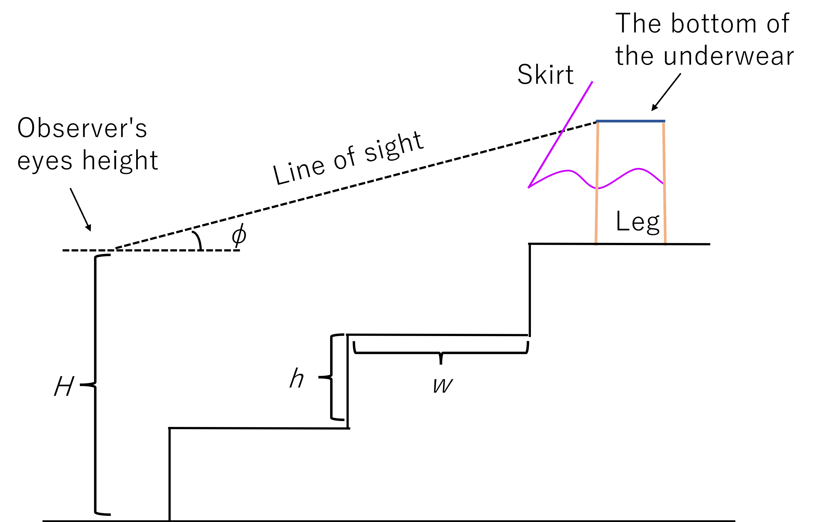

# Installation

Download and run [Panchira-Prevention-Simulator.xlsm](https://github.com/ItokenProgramming/Panchira-Prevention-Simulator/raw/main/Panchira-Prevention-Simulator.xlsm).

# Purpose

By using this software, you can simulate weather the lower person (hereinafter called "observer") on stairs can look at the underwear worn by the upper person (hereinafter called "observed person") wearing skirt (this action is hereinafter called "panchira") and prevent panchira in advance.

# Theory

As shown in Figure 1, the horizontal distance between the bottom of the skirt and the leg is $X_s$, the vertical distance between the ground and the bottom of the skirt is $Y_s$, and the vertical distance between the ground and the bottom of the underwear is $l$. Take $\theta$ as shown in Figure 1. Also, as shown in Figure 2, $h$ is the length of the stair riser, $w$ is the length of the tread, $H$ is the height of the observer's eyes. The number of stages is $n$ and the elevation angle of the observer's line of sight is $\phi$. However, both the observer and the observed person are standing upright at the center of the tread. At this time, $\theta$ can be expressed as 

$$ \theta = \arctan{ \frac{l - Y_s}{X_s}} $$

Moreover, the observer's line of sight, $\phi$ can be expressed as

$$ \phi = \arctan{ \frac{nh+l-H}{nw}} $$

In the situation where $\phi > \theta$ holds, namely

$$ \arctan{ \frac{nh+l-H}{nw}} > \arctan{ \frac{l - Y_s}{X_s}} $$

the observer can look at the underwear. In this situation, $\theta$ can be defined as "minimum visible elevation angle" 

Figure 1: Schematic drawing of the vicinity of the underwear

Figure 2: Schematic diagram of the whole stairs when panchira is impossible

# Conclusion

Please be aware that if you look at the underwear in public space based on the knowledge obtained from this simulator, you may be subject to punishment under local laws.

It would be an unexpected pleasure for me if this simulator can be used to prevent panchira.
